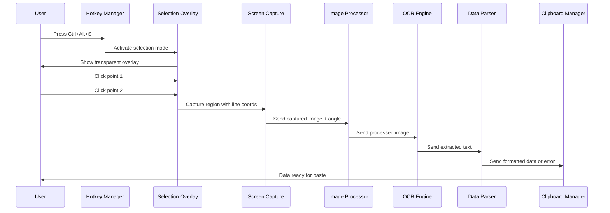

# Survey Plan Vector Extractor App - Design Document

## 1. Executive Summary

The Survey Plan Vector Extractor App is a desktop application designed to automate the extraction of bearing and distance data from survey plan images, eliminating manual data entry errors and streamlining surveyor workflows. The application uses advanced image processing, OCR technology, and intelligent data parsing to capture, process, and extract structured survey data with high accuracy.

### 1.1 Key Features
- Hotkey-activated screen capture with interactive region selection
- Automatic image rotation and enhancement for optimal OCR
- Configurable OCR profiles for different document types
- Intelligent bearing and distance extraction with unit conversion
- Tab-delimited clipboard output for seamless integration

### 1.2 Technology Stack
- **Core Language**: Python 3.8+
- **GUI Framework**: PyQt5/6
- **Image Processing**: OpenCV
- **OCR Engine**: Tesseract OCR
- **Screen Capture**: PyQt + platform-specific APIs
- **Data Processing**: Python regex + custom parsers

## 2. System Architecture

### 2.1 High-Level Architecture

```
┌─────────────────┐    ┌─────────────────┐    ┌─────────────────┐
│   User Input    │    │  Image Pipeline │    │  Data Pipeline  │
│                 │    │                 │    │                 │
│ • Hotkey        │───▶│ • Screen Capture│───▶│ • OCR Engine    │
│ • Region Select │    │ • Preprocessing │    │ • Data Parsing  │
│ • Profile Switch│    │ • Enhancement   │    │ • Unit Convert  │
└─────────────────┘    └─────────────────┘    └─────────────────┘
                                                        │
┌─────────────────┐    ┌─────────────────┐             │
│    Output       │    │  Configuration  │             │
│                 │◀───│                 │◀────────────┘
│ • Clipboard     │    │ • OCR Profiles  │
│ • Error Msgs    │    │ • Regex Patterns│
│ • Status Cues   │    │ • Unit Mappings │
└─────────────────┘    └─────────────────┘
```

### 2.2 Component Breakdown

#### 2.2.1 User Interface Layer
- **Global Hotkey Manager**: Listens for activation hotkeys
- **Interactive Overlay**: Provides visual feedback during selection
- **Profile Switcher**: Manages OCR profile switching
- **Status Indicator**: Shows active profile and operation status

#### 2.2.2 Image Processing Pipeline
- **Screen Capture Module**: Captures specified screen regions
- **Image Preprocessor**: Handles rotation, enhancement, and cleanup
- **Quality Analyzer**: Assesses image suitability for OCR

#### 2.2.3 OCR and Data Extraction
- **OCR Engine Interface**: Manages Tesseract configuration and execution
- **Text Parser**: Extracts bearing and distance using regex
- **Data Validator**: Validates extracted data for logical consistency

#### 2.2.4 Configuration Management
- **Profile Manager**: Stores and loads OCR profiles
- **Settings Controller**: Manages application preferences
- **Pattern Library**: Maintains regex patterns for different data types

## 3. Detailed Component Design

### 3.1 User Interface Components

#### 3.1.1 Global Hotkey Manager
```python
class HotkeyManager:
    def __init__(self):
        self.listeners = {}
        self.active_profile = "modern_cad"
    
    def register_hotkey(self, combination: str, callback: callable):
        """Register global hotkey with system"""
        pass
    
    def switch_profile(self, profile_name: str):
        """Switch active OCR profile"""
        pass
```

**Dependencies**: `pynput.keyboard`
**Key Features**:
- Cross-platform global hotkey detection
- Profile switching via Ctrl+1, Ctrl+2, Ctrl+3
- Main activation via Ctrl+Alt+S

#### 3.1.2 Interactive Selection Overlay
```python
class SelectionOverlay(QWidget):
    def __init__(self):
        super().__init__()
        self.setWindowFlags(Qt.FramelessWindowHint | Qt.WindowStaysOnTopHint)
        self.setAttribute(Qt.WA_TranslucentBackground)
        self.points = []
    
    def paintEvent(self, event):
        """Draw gizmo line and selection feedback"""
        pass
    
    def mousePressEvent(self, event):
        """Handle two-click line definition"""
        pass
```

**Key Features**:
- Full-screen transparent overlay
- Visual gizmo line between click points
- Precise pixel-level selection
- Immediate visual feedback

### 3.2 Image Processing Pipeline

#### 3.2.1 Screen Capture Module
```python
class ScreenCapture:
    def __init__(self):
        self.capture_backend = self._initialize_backend()
    
    def capture_region(self, x1: int, y1: int, x2: int, y2: int, 
                      safety_offset: int = 20) -> np.ndarray:
        """Capture screen region with proportional expansion"""
        # Calculate line angle and perpendicular expansion
        angle = math.atan2(y2 - y1, x2 - x1)
        
        # Expand region proportionally to line length
        line_length = math.sqrt((x2-x1)**2 + (y2-y1)**2)
        expansion = max(line_length * 0.3, safety_offset)
        
        # Calculate capture rectangle
        capture_rect = self._calculate_capture_rect(
            x1, y1, x2, y2, expansion
        )
        
        return self._capture_rect(capture_rect)
```

**Key Features**:
- Intelligent region expansion based on line length
- Safety offsets to ensure complete text capture
- Cross-platform compatibility via PyQt backend

#### 3.2.2 Image Preprocessor
```python
class ImagePreprocessor:
    def __init__(self, profile_config: dict):
        self.config = profile_config
    
    def process_image(self, image: np.ndarray, 
                     rotation_angle: float) -> np.ndarray:
        """Complete preprocessing pipeline"""
        # 1. Rotate to horizontal
        rotated = self._rotate_image(image, rotation_angle)
        
        # 2. Apply profile-specific enhancements
        enhanced = self._apply_profile_enhancements(rotated)
        
        # 3. Final OCR preparation
        prepared = self._prepare_for_ocr(enhanced)
        
        return prepared
    
    def _rotate_image(self, image: np.ndarray, angle: float) -> np.ndarray:
        """Rotate image to make text horizontal"""
        height, width = image.shape[:2]
        center = (width // 2, height // 2)
        
        rotation_matrix = cv2.getRotationMatrix2D(center, angle, 1.0)
        rotated = cv2.warpAffine(image, rotation_matrix, (width, height),
                               flags=cv2.INTER_CUBIC,
                               borderMode=cv2.BORDER_REPLICATE)
        return rotated
    
    def _apply_profile_enhancements(self, image: np.ndarray) -> np.ndarray:
        """Apply profile-specific image enhancements"""
        if self.config['noise_reduction']:
            image = cv2.medianBlur(image, self.config['blur_kernel'])
        
        if self.config['contrast_enhancement']:
            image = cv2.convertScaleAbs(image, 
                                      alpha=self.config['contrast_alpha'],
                                      beta=self.config['contrast_beta'])
        
        if self.config['binarization']:
            gray = cv2.cvtColor(image, cv2.COLOR_BGR2GRAY)
            _, image = cv2.threshold(gray, 0, 255, 
                                   cv2.THRESH_BINARY + cv2.THRESH_OTSU)
        
        return image
```

### 3.3 OCR and Data Extraction

#### 3.3.1 OCR Engine Interface
```python
class OCREngine:
    def __init__(self):
        self.tesseract_config = {
            'modern_cad': {
                'psm': 6,  # Single uniform block
                'oem': 1,  # LSTM engine
                'whitelist': 'NSEW0123456789.°\'"',
                'config': '--psm 6 -c tessedit_char_whitelist=NSEW0123456789.°\'"'
            },
            'old_scans': {
                'psm': 3,  # Fully automatic page segmentation
                'oem': 1,
                'whitelist': 'NSEW0123456789.°\'"',
                'config': '--psm 3 -c tessedit_char_whitelist=NSEW0123456789.°\'"'
            }
        }
    
    def extract_text(self, image: np.ndarray, profile: str) -> str:
        """Extract text using Tesseract with profile settings"""
        config = self.tesseract_config[profile]
        
        try:
            text = pytesseract.image_to_string(
                image, 
                config=config['config']
            )
            return text.strip()
        except Exception as e:
            logger.error(f"OCR failed: {e}")
            return ""
```

#### 3.3.2 Data Parser
```python
class DataParser:
    def __init__(self):
        self.bearing_patterns = [
            r'[NS]\s*\d{1,2}[°\-]\d{1,2}[\'′\-]\d{1,2}[\"″\s]*[EW]',
            r'\d{1,2}[°\-]\d{1,2}[\'′\-]\d{1,2}[\"″]',  # Without cardinal
            r'[NS]\s*\d{1,2}[°\-]\d{1,2}[\'′][EW]',     # No seconds
        ]
        
        self.distance_patterns = [
            r'\d{1,4}(?:,\d{3})*(?:\.\d+)?(?:\s*(?:ft|lks|m|\'|"))?',
            r'\d+\.\d+',  # Simple decimal
            r'\d+',       # Integer only
        ]
    
    def parse_survey_data(self, text: str) -> tuple:
        """Extract bearing and distance from OCR text"""
        bearing = self._extract_bearing(text)
        distance = self._extract_distance(text)
        
        if not bearing or not distance:
            return None, None
        
        return bearing, distance
    
    def _extract_bearing(self, text: str) -> str:
        """Extract bearing using multiple pattern attempts"""
        for pattern in self.bearing_patterns:
            matches = re.findall(pattern, text, re.IGNORECASE)
            if matches:
                return matches[0].strip()
        return None
    
    def _extract_distance(self, text: str) -> str:
        """Extract distance with contextual filtering"""
        for pattern in self.distance_patterns:
            matches = re.findall(pattern, text)
            if matches:
                # Filter out obviously wrong matches (too small/large)
                valid_matches = [m for m in matches 
                               if self._is_valid_distance(m)]
                if valid_matches:
                    return valid_matches[0]
        return None
```

### 3.4 Configuration Management

#### 3.4.1 OCR Profiles
```python
OCR_PROFILES = {
    'modern_cad': {
        'name': 'Modern CAD Plans',
        'hotkey': 'ctrl+1',
        'preprocessing': {
            'noise_reduction': False,
            'blur_kernel': 3,
            'contrast_enhancement': True,
            'contrast_alpha': 1.2,
            'contrast_beta': 10,
            'binarization': False,
            'dpi_scaling': False
        },
        'ocr_settings': {
            'psm': 6,
            'oem': 1,
            'whitelist': 'NSEW0123456789.°\'"',
            'confidence_threshold': 60
        },
        'unit_conversion': {
            'default_distance_unit': 'feet',
            'output_distance_unit': 'meters',
            'bearing_format': 'decimal_degrees'
        }
    },
    
    'old_scans': {
        'name': 'Old Scanned Plans',
        'hotkey': 'ctrl+2',
        'preprocessing': {
            'noise_reduction': True,
            'blur_kernel': 5,
            'contrast_enhancement': True,
            'contrast_alpha': 1.5,
            'contrast_beta': 20,
            'binarization': True,
            'dpi_scaling': True,
            'target_dpi': 300
        },
        'ocr_settings': {
            'psm': 3,
            'oem': 1,
            'whitelist': 'NSEW0123456789.°\'"',
            'confidence_threshold': 40
        },
        'unit_conversion': {
            'default_distance_unit': 'links',
            'output_distance_unit': 'meters',
            'bearing_format': 'decimal_degrees'
        }
    }
}
```

## 4. Data Flow and Processing

### 4.1 Main Workflow Sequence



### 4.2 Error Handling Flow

```mermaid
flowchart TD
    A[Start Process] --> B[Capture Image]
    B --> C{Image Quality OK?}
    C -->|No| D[Output: "capture error"]
    C -->|Yes| E[Process Image]
    E --> F[Run OCR]
    F --> G{Text Extracted?}
    G -->|No| H[Output: "text error"]
    G -->|Yes| I[Parse Data]
    I --> J{Valid Bearing & Distance?}
    J -->|No| K[Output: "pattern error"]
    J -->|Yes| L[Convert Units]
    L --> M[Format Output]
    M --> N[Copy to Clipboard]
    N --> O[End]
    
    D --> O
    H --> O
    K --> O
```

## 5. Implementation Details

### 5.1 File Structure
```
survey_extractor/
├── main.py                 # Application entry point
├── core/
│   ├── __init__.py
│   ├── hotkey_manager.py   # Global hotkey handling
│   ├── screen_capture.py   # Screen capture functionality
│   ├── image_processor.py  # Image preprocessing
│   ├── ocr_engine.py      # OCR interface
│   └── data_parser.py     # Data extraction and parsing
├── ui/
│   ├── __init__.py
│   ├── overlay.py         # Selection overlay
│   └── status_widget.py   # Status indicator
├── config/
│   ├── __init__.py
│   ├── profiles.py        # OCR profile definitions
│   └── settings.py        # Application settings
├── utils/
│   ├── __init__.py
│   ├── conversions.py     # Unit conversion functions
│   ├── validators.py      # Data validation
│   └── clipboard.py       # Clipboard operations
└── tests/
    ├── test_ocr.py
    ├── test_parser.py
    └── test_conversions.py
```

### 5.2 Key Dependencies
```python
# requirements.txt
PyQt5>=5.15.0
opencv-python>=4.5.0
pytesseract>=0.3.8
pynput>=1.7.0
pyperclip>=1.8.0
numpy>=1.21.0
Pillow>=8.3.0
```

### 5.3 Unit Conversion Implementation
```python
class UnitConverter:
    CONVERSION_FACTORS = {
        'links_to_meters': 0.201168,
        'feet_to_meters': 0.3048,
        'chains_to_meters': 20.1168,
        'rods_to_meters': 5.0292
    }
    
    def convert_distance(self, value: float, from_unit: str, 
                        to_unit: str) -> float:
        """Convert distance between units"""
        if from_unit == to_unit:
            return value
        
        # Convert to meters first, then to target unit
        meters = value * self.CONVERSION_FACTORS.get(
            f"{from_unit}_to_meters", 1.0
        )
        
        target_factor = self.CONVERSION_FACTORS.get(
            f"meters_to_{to_unit}", 1.0
        )
        
        return meters / target_factor if target_factor != 1.0 else meters
    
    def convert_bearing_to_decimal(self, bearing_str: str) -> float:
        """Convert DMS bearing to decimal degrees"""
        # Parse N 45°30'20" E format
        pattern = r'([NS])\s*(\d+)[°\-](\d+)[\'′\-](\d+)[\"″\s]*([EW])'
        match = re.match(pattern, bearing_str.strip())
        
        if not match:
            raise ValueError(f"Invalid bearing format: {bearing_str}")
        
        ns, degrees, minutes, seconds, ew = match.groups()
        
        decimal = float(degrees) + float(minutes)/60 + float(seconds)/3600
        
        # Apply quadrant corrections if needed
        if ns == 'S':
            decimal = -decimal
        if ew == 'W':
            decimal = 360 - decimal if decimal > 0 else -decimal
        
        return decimal
```

## 6. Performance Considerations

### 6.1 Optimization Strategies

#### 6.1.1 Image Processing Optimization
- **Lazy Loading**: Only process images when needed
- **Memory Management**: Use OpenCV's efficient memory handling
- **Threading**: Offload processing to background threads
- **Caching**: Cache processed images for retry scenarios

#### 6.1.2 OCR Performance
- **Region Optimization**: Minimize OCR region size
- **Profile Switching**: Quick profile parameter changes
- **Confidence Thresholds**: Early exit on low confidence
- **Parallel Processing**: Multiple OCR attempts if needed

### 6.2 Memory Management
```python
class MemoryManager:
    def __init__(self, max_cache_size: int = 10):
        self.image_cache = {}
        self.max_cache_size = max_cache_size
    
    def cache_image(self, key: str, image: np.ndarray):
        """Cache processed image with size limit"""
        if len(self.image_cache) >= self.max_cache_size:
            # Remove oldest entry
            oldest_key = next(iter(self.image_cache))
            del self.image_cache[oldest_key]
        
        self.image_cache[key] = image.copy()
    
    def cleanup(self):
        """Force cleanup of cached images"""
        self.image_cache.clear()
        gc.collect()
```

## 7. Testing Strategy

### 7.1 Unit Testing
- **Image Processing**: Test rotation, enhancement algorithms
- **OCR Engine**: Test with known good/bad images
- **Data Parser**: Test regex patterns with various formats
- **Unit Conversion**: Verify mathematical accuracy

### 7.2 Integration Testing
- **End-to-End Workflow**: Complete capture-to-clipboard flow
- **Profile Switching**: Verify profile changes affect processing
- **Error Handling**: Test failure scenarios and recovery

### 7.3 Performance Testing
- **Response Time**: Measure hotkey-to-clipboard latency
- **Memory Usage**: Monitor memory consumption over time
- **Accuracy Testing**: Test with diverse survey plan samples

## 8. Deployment and Distribution

### 8.1 Packaging Strategy
```python
# setup.py for PyInstaller
import PyInstaller.__main__

PyInstaller.__main__.run([
    'main.py',
    '--onefile',
    '--windowed',
    '--add-data', 'config;config',
    '--add-data', 'tessdata;tessdata',
    '--hidden-import', 'pynput.keyboard._win32',
    '--hidden-import', 'pynput.mouse._win32',
    '--name', 'SurveyExtractor'
])
```

### 8.2 Installation Requirements
- **Tesseract OCR**: System-level installation required
- **Visual C++ Redistributable**: For Windows deployment
- **Python Runtime**: Bundled with PyInstaller
- **Configuration Files**: Included in package

### 8.3 Cross-Platform Considerations
- **Windows**: Native hotkey support, efficient screen capture
- **macOS**: Accessibility permissions required for global hotkeys
- **Linux**: X11 dependencies for screen capture and hotkeys

## 9. Future Enhancements

### 9.1 Advanced Features
- **Batch Processing**: Process multiple regions in sequence
- **Machine Learning**: Custom OCR models for survey symbols
- **Layout Analysis**: Intelligent document structure recognition
- **Cloud Sync**: Profile synchronization across devices

### 9.2 Integration Possibilities
- **CAD Software**: Direct integration with AutoCAD, MicroStation
- **Survey Software**: Integration with Trimble, Leica software
- **Database**: Direct database insertion capabilities
- **Web Interface**: Browser-based version for remote access

### 9.3 Quality Improvements
- **Adaptive OCR**: Machine learning-based profile selection
- **Error Correction**: Intelligent post-processing of OCR results
- **User Training**: Custom pattern learning from user corrections
- **Confidence Scoring**: Visual indicators of extraction confidence

## 10. Conclusion

The Survey Plan Vector Extractor App represents a comprehensive solution for automating survey data extraction. The proposed architecture balances performance, accuracy, and maintainability while providing a foundation for future enhancements. The modular design ensures that individual components can be optimized or replaced as technology evolves, while the configurable profile system addresses the diverse quality requirements of different survey plan types.

The implementation leverages proven open-source technologies while maintaining the flexibility to integrate commercial solutions where higher accuracy is required. The focus on user experience through intuitive hotkey activation, visual feedback, and clear error handling ensures that the application will integrate seamlessly into existing surveyor workflows.

Success metrics for the application should include:
- **Accuracy**: >95% correct extraction for modern CAD plans, >85% for old scans
- **Performance**: <3 seconds from hotkey to clipboard output
- **Reliability**: <1% application crashes or failures
- **User Adoption**: Positive feedback from surveying professionals

This design document provides the technical foundation for developing a robust, efficient, and user-friendly tool that addresses the critical need for automated survey data extraction in the land surveying industry.